

🤖 AI Resume Analyzer

Intelligent Resume Analysis, Scoring, Recommendations & Admin Analytics

A Streamlit-based resume analysis application that extracts useful information from resumes, evaluates resume quality, provides recommendations, and presents analytics for users and administrators.

Developed & customized by Utsav Singh

📌 Overview

AI Resume Analyzer is a resume analysis application built with Python and Streamlit. It parses uploaded resumes using Natural Language Processing techniques, identifies important resume information and skills, and provides useful recommendations to help users improve their resumes.

The project also includes an Admin section for viewing user data, exported records, feedback, ratings, and analytical charts.

✨ Main Features

👤 User / Client Side

Upload and analyze a resume

Extract basic resume information

Identify skills and important keywords

Predict suitable job field / role

Recommend additional skills

Recommend courses and certifications

Generate resume improvement tips

Calculate an overall resume score

Provide interview and resume-related recommendations

Show personalized analysis based on the uploaded resume

🧑‍💼 Admin Dashboard

View applicant/user data

View total user count

Export user information to CSV

View feedback and ratings

Analyze predicted fields / roles

Analyze experience levels

Analyze resume score distribution

View location-based analytics

View city, state and country statistics

💬 Feedback Module

Submit user feedback

Give ratings from 1 to 5

View rating analytics

View previous feedback/comments

🛠️ Tech Stack

Area

Technologies

Frontend / UI

Streamlit, HTML, CSS

Backend

Python

NLP & Resume Parsing

NLTK, pyresparser, pdfminer3

Data Processing

Pandas

Visualization

Plotly

Database

Local application database / configured database layer

Version Control

Git & GitHub

📂 Project Structure

AI-Resume-Analyzer/
│
├── App/
│   ├── app.py
│   ├── App1.py
│   ├── Courses.py
│   ├── nlp_loader.py
│   ├── resume_parser.py
│   ├── utils.py
│   ├── requirements.txt
│   │
│   └── Logo/
│       ├── Resume-Analyzer.mp4
│       ├── Updatedarkmode.jpeg
│       ├── Updatelightmode.jpeg
│       └── recommend.png
│
├── screenshots/
│   ├── user/
│   ├── admin/
│   └── feedback/
│
├── .gitignore
├── LICENSE
└── README.md

Uploaded resumes, virtual environments and local database files are intentionally excluded from the public repository.

📸 Application Screenshots

👤 User Side

1. Main Screen

  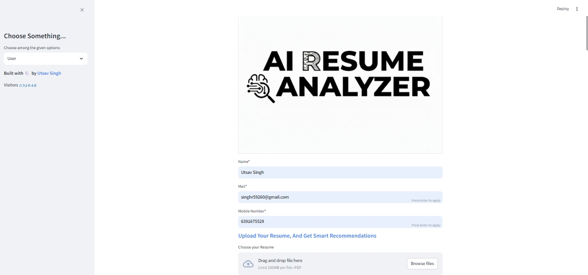

2. Resume Analysis

  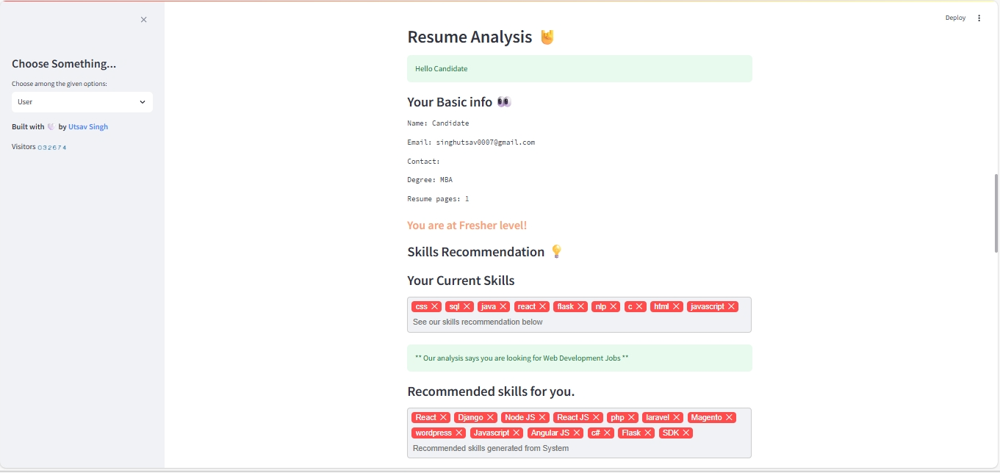

3. Skill Recommendation

  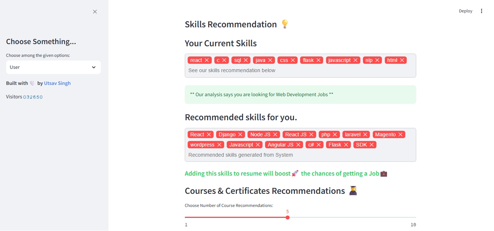

4. Course / Recommendation Section

  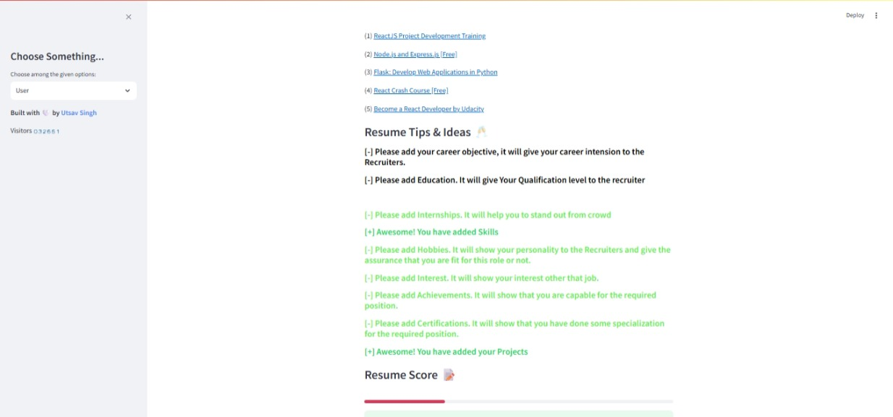

5. Resume Recommendations

  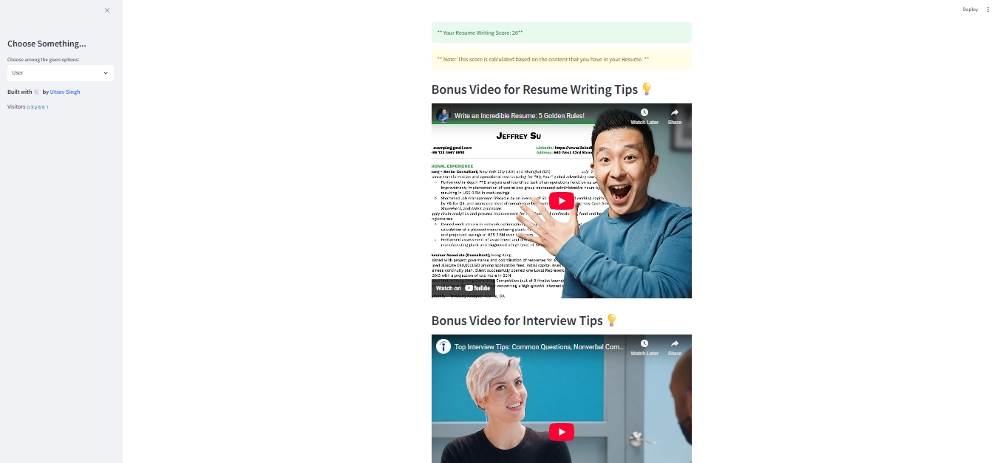

💬 Feedback Screens

Feedback Form

  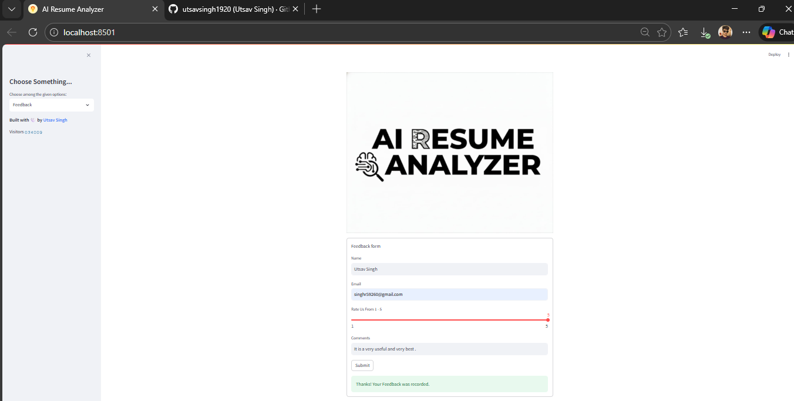

Feedback Analytics

  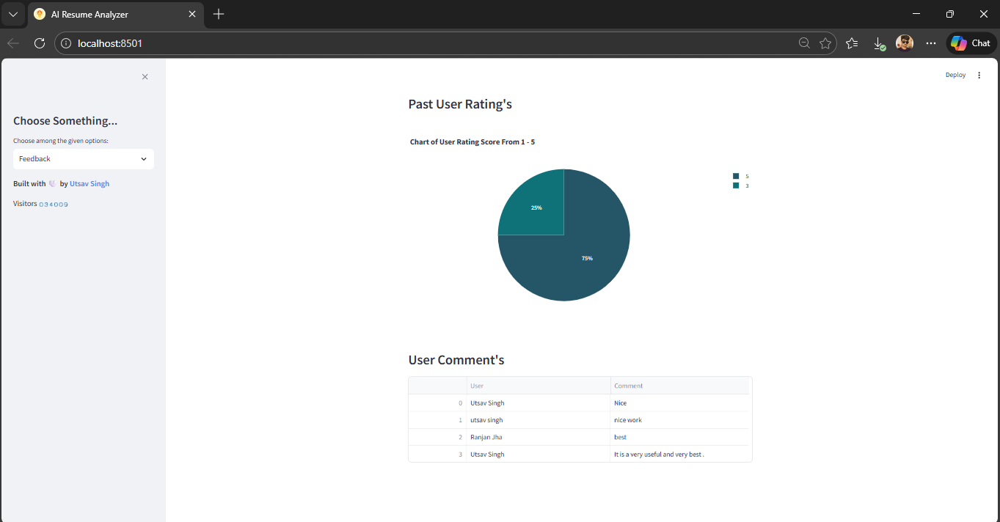

🧑‍💼 Admin Dashboard

1. Admin / User Data Dashboard

  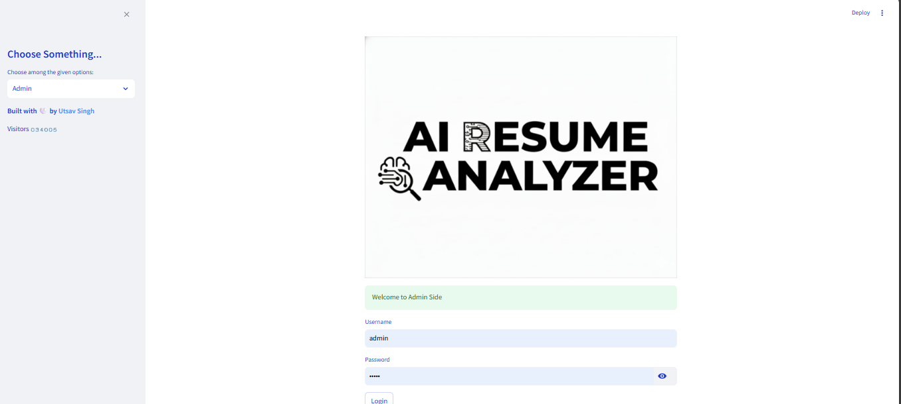

2. User Data

  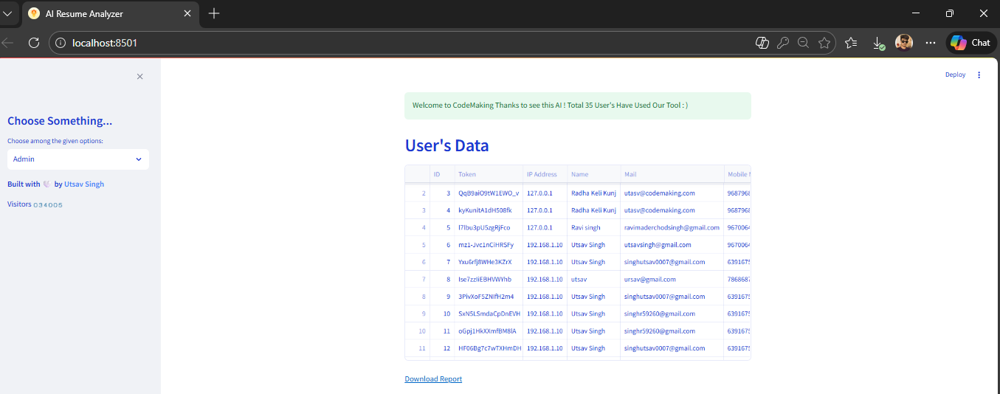

3. Exported CSV Data

  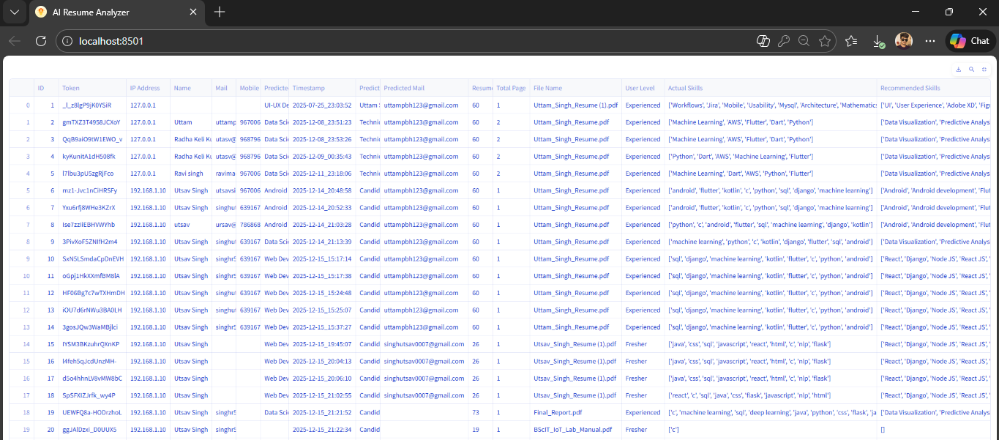

4. Feedback Data

  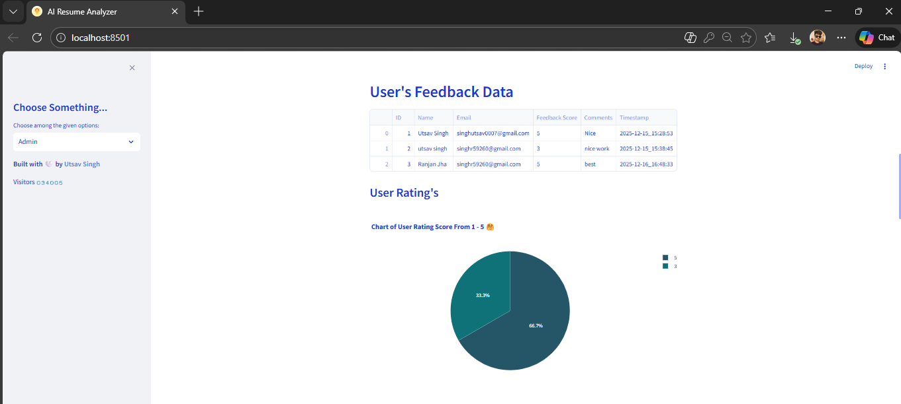

5. Experience Analytics

  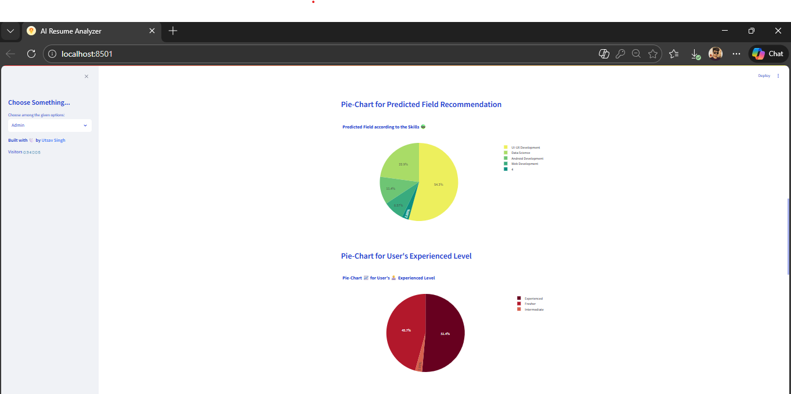

6. Resume Score Analytics

  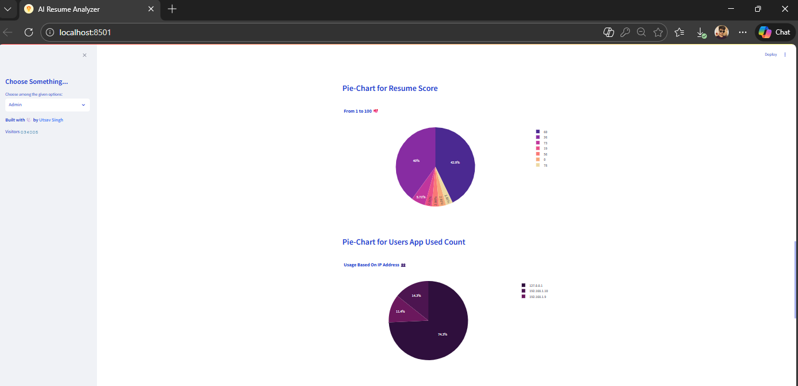

7. Location Analytics

  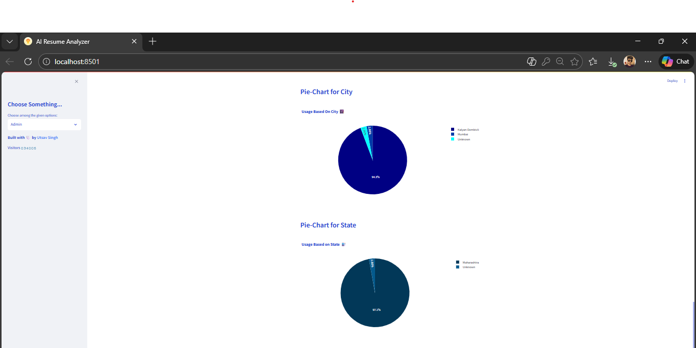

8. Country Analytics

  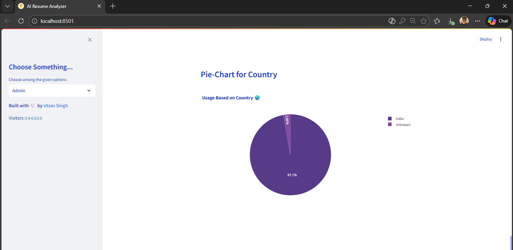

🚀 Installation & Setup

1. Clone the repository

git clone https://github.com/utsavsingh1920/AI-Resume-Analyzer.git
cd AI-Resume-Analyzer

2. Create a virtual environment

python -m venv venv

3. Activate the virtual environment

Windows

venv\Scripts\activate

macOS / Linux

source venv/bin/activate

4. Install dependencies

cd App
pip install -r requirements.txt

5. Install the spaCy English model if required

python -m spacy download en_core_web_sm

6. Run the application

streamlit run app.py

Streamlit will display the local URL in the terminal, usually:

http://localhost:8501

💡 How It Works

Upload Resume
      ↓
Resume Parsing
      ↓
Information & Skill Extraction
      ↓
NLP-Based Analysis
      ↓
Role / Skill Recommendations
      ↓
Resume Score & Improvement Tips
      ↓
Analytics / Feedback

🔐 Privacy & Repository Safety

The public GitHub repository does not include:

Uploaded user resumes

Virtual environment (venv)

Local database files

Environment or secret files

This keeps personal and machine-specific data outside version control.

🔮 Future Improvements

Improve resume parsing accuracy

Add support for more job roles

Improve recommendation quality

Add more advanced skill matching

Improve resume scoring

Add more dashboard analytics

Add cloud deployment

Improve UI responsiveness

Add multilingual resume support

Add ATS-focused analysis

🎓 Project Purpose

This project was developed/customized as an academic and portfolio project to demonstrate practical skills in:

Python • Streamlit • NLP • Resume Parsing • Data Analysis • Visualization • Git • GitHub

🙏 Acknowledgements

This project uses and builds upon open-source tools and ideas from the resume parsing / NLP ecosystem, including:

pyresparser

NLTK

Streamlit

Plotly

The project was customized and developed further for academic and portfolio use. Existing third-party licenses and attribution should be preserved where applicable.

👨‍💻 Developer

Utsav Singh

B.Sc. Information Technology Graduate
Interested in Software Development, Flutter, Full-Stack Development and AI-based applications

GitHub: utsavsingh1920

Project Repository: AI-Resume-Analyzer

⭐ Support

If you find this project useful, consider giving the repository a ⭐ Star.

🤖 AI RESUME ANALYZER

Built & customized with ❤️ by Utsav Singh

© 2026 Utsav Singh

